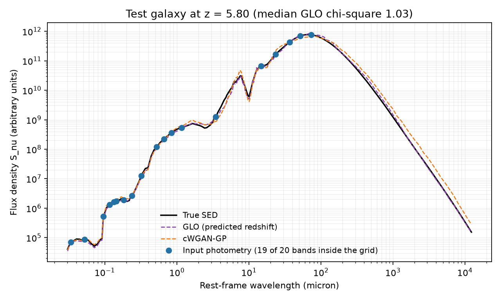
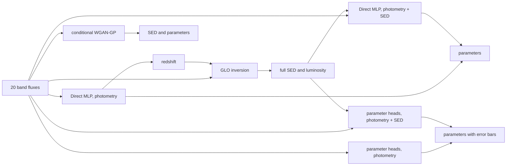

# galaxy-sed

Reconstruct the full spectral energy distribution (SED) of a galaxy, and estimate its physical parameters, from its photometry in 20 broad bands.



_A test galaxy whose GLO reconstruction has the median quality of the test set: the true SED (black), the two reconstructions (dashed) and the input fluxes (blue), placed at their rest-frame wavelengths._

## What it does

Large surveys measure the light of millions of galaxies in a few broad bands, here 20 bands from the far ultraviolet to the submillimetre. From those 20 numbers, this code recovers:

- the complete SED, on a 223-point rest-frame grid from 0.03 to 12,340 micron
- the physical parameters of the model that produced it (redshift, properties of the starburst, of the host galaxy and of the dusty torus around the active nucleus, luminosity of each component), each with a per-galaxy error bar
- the bolometric luminosity, integrated from the reconstructed SED.

The models are trained on radiative-transfer simulations of galaxies with an active galactic nucleus (CYGNUS models: starburst, host galaxy, AGN torus and polar dust).

## Pipeline



1. **Direct MLP.** A multilayer perceptron maps the fluxes (and a mask of missing bands) to all the parameters. Its redshift estimate tells where each band falls in the galaxy's rest frame. A second direct MLP reads the reconstructed SED as well.
2. **GLO inversion.** A generator is trained by generative latent optimisation (Bojanowski et al. 2018): the network and one latent code per training galaxy are learned together, the SED and parameter losses being balanced by learned weights (Kendall et al. 2018). For a new galaxy, a latent code is searched so that the generated SED, observed at the predicted redshift, reproduces the 20 fluxes. The search starts from 5 random points and the results are averaged. The same principle was used by Rissaki et al. (2024) for mid-infrared spectra.
3. **Parameter heads.** One small network per parameter. Parameters sampled on a few values by the simulation library are treated as a classification over those values. Each head returns a value and an error bar. The input is either the photometry alone or the photometry plus the reconstructed SED.
4. **Conditional WGAN-GP.** A generative adversarial network (Mirza and Osindero 2014, Gulrajani et al. 2017) whose generator receives the photometry and random noise. Averaging 25 draws gives an SED and parameters without any optimisation, which makes it the adversarial alternative to GLO.

The parameter networks therefore cross two choices: one network for all the parameters (direct MLP) or one per parameter (heads), and the photometry alone or the photometry plus the reconstructed SED. All four combinations are provided, only the heads give error bars.

## Results

On the test set of the training simulations: CYGNUS torus with a disc host galaxy, redshift from 0.1 to 7, 49,895 galaxies with a starburst, split 80/10/10 into training, validation and test sets (4,990 test galaxies). All numbers below were produced by the scripts of this repository with `config.json`.

**Full SED.** R² over all wavelengths of the standardised log SED, and fraction of galaxies with χ² < 5 on the rest-frame 5 to 35 micron interval, as defined by Rissaki et al. (2024) with a 10 % uncertainty on both the reconstruction and the truth. Times are per galaxy on an NVIDIA RTX 5080.

| Route                              |    R² | χ² < 5 | median χ² | time per galaxy |
| ---------------------------------- | ----: | -----: | --------: | --------------: |
| GLO inversion (predicted redshift) | 0.987 | 86.4 % |      1.03 |         14.8 ms |
| conditional WGAN-GP                | 0.979 | 82.1 % |      1.72 |         0.08 ms |

**Bolometric luminosity**, integrated over frequency from the reconstructed SED:

| Route               | R² on log10 L |
| ------------------- | ------------: |
| GLO inversion       |         0.998 |
| conditional WGAN-GP |         0.994 |

**Physical parameters.** R² for continuous parameters (in log10 for scale parameters). For a parameter sampled on K values, balanced accuracy, whose chance level is 1/K.

| Parameter                                     | Direct MLP, photometry | Direct MLP, photometry + SED | Heads, photometry | Heads, photometry + SED | cWGAN-GP |
| --------------------------------------------- | ---------------------: | ---------------------------: | ----------------: | ----------------------: | -------: |
| redshift                                      |                   0.99 |                         0.99 |              1.00 |                    1.00 |     0.91 |
| metallicity (K = 3)                           |                   0.64 |                         0.60 |              0.81 |                    0.66 |     0.34 |
| sb_tau_v, starburst optical depth (K = 3)     |                   0.34 |                         0.34 |              0.36 |                    0.35 |     0.33 |
| sb_age, starburst age (K = 13)                |                   0.11 |                         0.11 |              0.12 |                    0.12 |     0.09 |
| sb_te, starburst e-folding time (K = 6)       |                   0.23 |                         0.23 |              0.22 |                    0.23 |     0.19 |
| host_tv, host optical depth (K = 5)           |                   0.46 |                         0.46 |              0.54 |                    0.52 |     0.22 |
| host_psi, host starlight intensity (K = 3)    |                   0.60 |                         0.55 |              0.64 |                    0.60 |     0.33 |
| host_tau, host e-folding time (K = 2)         |                   0.94 |                         0.94 |              0.94 |                    0.94 |     0.75 |
| host_iview, host inclination                  |                   0.65 |                         0.65 |              0.65 |                    0.65 |     0.14 |
| polar_T, polar dust temperature (K = 10)      |                   0.22 |                         0.24 |              0.32 |                    0.33 |     0.13 |
| f_host, host luminosity scaling               |                   0.98 |                         0.98 |              0.99 |                    0.99 |     0.92 |
| f_sb, starburst luminosity scaling            |                   0.52 |                         0.50 |              0.49 |                    0.47 |     0.11 |
| f_agn, torus luminosity scaling               |                   0.74 |                         0.73 |              0.74 |                    0.72 |     0.36 |
| f_pol, polar dust luminosity scaling          |                   0.61 |                         0.64 |              0.80 |                    0.79 |    -12.6 |
| AGNpar_0, torus outer to inner radius (K = 3) |                   0.33 |                         0.33 |              0.33 |                    0.34 |     0.33 |
| AGNpar_1, torus UV optical depth (K = 4)      |                   0.26 |                         0.26 |              0.28 |                    0.28 |     0.25 |
| AGNpar_2, torus half-opening angle (K = 5)    |                   0.25 |                         0.27 |              0.28 |                    0.31 |     0.20 |
| AGNpar_3, torus inclination                   |                   0.42 |                         0.41 |              0.41 |                    0.39 |     0.12 |

**Error bars of the parameter heads**, over the continuous parameters: the truth lies within one error bar for 72.3 % of the test galaxies (68.3 % expected for a calibrated Gaussian) and within two for 97.0 % (95.4 % expected). The error bars are close to calibrated, slightly conservative.

How to read these numbers:

- The GLO inversion gives the most accurate SED. The conditional WGAN-GP is less accurate but about 175 times faster, since it needs no optimisation.
- For the parameters, the heads reading the photometry are the best route. Adding the reconstructed SED improves neither the heads nor the direct MLP: the reconstruction is computed from the same 20 fluxes and brings no new information.
- Several parameters stay close to chance: the starburst optical depth, age and e-folding time, and the torus geometry. Galaxies that differ in these parameters can have almost identical photometry, so 20 broadband fluxes cannot constrain them. These scores measure a physical degeneracy, not a failure of the models.
- Metallicity is classified well only because the simulations tie its value to the redshift, it is not measured from the shape of the spectrum.
- The cWGAN-GP fails on f_pol. This scaling only means something for galaxies with polar dust, the other routes ignore it elsewhere through a masked loss, whereas the adversarial objective reproduces the mixture of galaxies with and without polar dust.

## Installation

The project uses [uv](https://docs.astral.sh/uv/) and Python 3.12.

```bash
git clone https://github.com/LitteRabbit-37/galaxy-sed.git
cd galaxy-sed
uv sync
uv run python -m unittest discover -s tests
```

A CUDA GPU is recommended for training and for the GLO inversion, everything also runs on CPU, but slower.

## Usage

### Predict with the provided models

```bash
uv run python scripts/predict.py --input my_photometry.csv --output predictions
```

The input is a CSV file with one row per galaxy and one column per band, named as in `config.json` (`GALEX FUV`, `GALEX NUV`, ..., `Herschel SPIRE500`). A `.npz` file with an array `photometry` of shape (n_galaxies, 20) also works. Leave a cell empty for a missing band.

The script writes `predictions.csv` (redshift and parameters with their error bars) and `predictions.npz` (everything, including the reconstructed SEDs and luminosities). Error bars are in the units of each parameter, or in dex for parameters modelled in log10.

### Train from scratch

```bash
uv run python scripts/01_prepare_data.py --raw path/to/simulations.npz
uv run python scripts/02_train_direct_mlp.py
uv run python scripts/03_train_glo.py
uv run python scripts/04_reconstruct_sed.py
uv run python scripts/02_train_direct_mlp.py --input hybrid
uv run python scripts/05_train_parameter_heads.py --input photometry
uv run python scripts/05_train_parameter_heads.py --input hybrid
uv run python scripts/06_train_cwgan.py
uv run python scripts/07_predict_cwgan.py --split test
uv run python scripts/08_evaluate.py --split test
```

Every script reads `config.json` and writes to `outputs/`. The model files written there have the same names as in `weights/`, so `predict.py --models outputs` uses your own models.

The simulations used for the results above are not distributed with this repository. The raw training file is a `.npz` archive with:

| Array                | Shape                | Content                                                                                                                  |
| -------------------- | -------------------- | ------------------------------------------------------------------------------------------------------------------------ |
| `wave`               | (n_wave,)            | rest-frame wavelength grid, in micron                                                                                    |
| `flux`               | (n_galaxies, n_wave) | rest-frame SED, flux density per unit frequency                                                                          |
| `redshift`           | (n_galaxies,)        | redshift                                                                                                                 |
| one array per target | (n_galaxies,)        | parameter values, named as in `config.json`                                                                              |
| `AGNpars`            | (n_galaxies, 4)      | torus parameters, read as targets `AGNpar_0` to `AGNpar_3`                                                               |
| `sb_on`, `polar_on`  | (n_galaxies,)        | optional 0/1 flags: galaxies without a starburst are excluded, polar-dust targets are ignored where polar dust is absent |

Photometry is computed by sampling each rest-frame SED at the rest wavelengths of the observed bands, `lambda_obs / (1 + z)` (`galaxy_sed.data.synthetic_photometry`). Bands that fall outside the grid, the far-ultraviolet ones at high redshift, are masked.

## Provided models

`weights/` contains the models trained by the commands above, with the normalisation statistics of the training set (`preprocessing.json`):

| File                            | Model                                                            |
| ------------------------------- | ---------------------------------------------------------------- |
| `direct_mlp.pt`                 | direct MLP reading the photometry, also used for the redshift    |
| `direct_mlp_hybrid.pt`          | direct MLP reading the photometry and the reconstructed SED      |
| `glo.pt`                        | GLO generator                                                    |
| `parameter_heads_photometry.pt` | parameter heads reading the photometry                           |
| `parameter_heads_hybrid.pt`     | parameter heads reading the photometry and the reconstructed SED |
| `cwgan.pt`                      | generator of the conditional WGAN-GP                             |

They are plain PyTorch files loaded with `weights_only=True`.

**Domain of validity.** The models were trained on noiseless simulations, with fluxes in the arbitrary units of the CYGNUS library and the 20 bands of `config.json`. They give meaningful results for inputs prepared the same way. For real observations, fluxes have to be converted to the same units, and a model retrained with realistic noise and missing bands will be more reliable than the provided weights.

## Repository layout

```text
galaxy-sed/
├── config.json         bands, targets and hyperparameters of every model
├── galaxy_sed/         the library
│   ├── data.py         photometry, splits and normalisation
│   ├── models.py       network architectures
│   ├── training.py     training loops
│   ├── inference.py    redshift, GLO inversion, parameter heads, cWGAN-GP sampling
│   ├── metrics.py      SED and parameter scores, bolometric luminosity
│   └── io.py           model files and inputs, seeds, file names
├── scripts/            the steps of the pipeline, in order, and predict.py
├── weights/            the provided models
├── docs/               figure of this page
└── tests/              unit tests
```

## Reproducibility

All hyperparameters and random seeds are in `config.json`. Seeds are set at the start of every training and inference step, and cuDNN is restricted to deterministic algorithms, so the same configuration on the same hardware and software gives the same models. The training, validation and test sets are fixed by `split_seed`, and every normalisation statistic is computed on the training set only.

## Citation

If you use this code, please cite:

> Florian, _GLO and GAN Models: Theory and Applications in Sciences_, Master's thesis, European University Cyprus, 2027.

## Acknowledgements

I thank Andreas Efstathiou for the CYGNUS simulations and for his guidance on the physical models, and Vicky Papadopoulou Lesta for supervising this work.

## References

- Bojanowski, Joulin, Lopez-Paz and Szlam (2018), _Optimizing the latent space of generative networks_, ICML.
- Efstathiou et al. (2022), MNRAS 512, 5183 (CYGNUS radiative-transfer models).
- Gulrajani, Ahmed, Arjovsky, Dumoulin and Courville (2017), _Improved training of Wasserstein GANs_, NeurIPS.
- Kendall, Gal and Cipolla (2018), _Multi-task learning using uncertainty to weigh losses for scene geometry and semantics_, CVPR.
- Mirza and Osindero (2014), _Conditional generative adversarial nets_, arXiv:1411.1784.
- Rissaki et al. (2024), _Reconstructing the mid-infrared spectra of galaxies using ultraviolet to submillimeter photometry and deep generative networks_, Astronomy and Computing 47, 100823.

## License

GNU Affero General Public License v3.0, see [LICENSE](LICENSE). You may use, modify and share this code, any modified version you distribute or run as a network service must be released under the same license.
